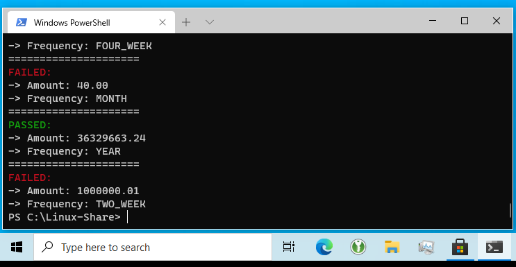

# NHS BSA Assignment 1

1\.  [Metadata](#metadata)  
2\.  [Synopsis](#synopsis)  
3\.  [Download/Files](#download/files)  
4\.  [Release](#release)  
5\.  [Requirements Engineering](#requirementsengineering)  
5.1\.  [Terms (Frequency & Amount)](#termsfrequency&amount)  
5.2\.  [Acceptance Criteria (Defined Parameters in isolation)](#acceptancecriteriadefinedparametersinisolation)  
5.2.1\.  [Invalid Amount](#invalidamount)  
5.2.2\.  [Null Frequency](#nullfrequency)  
5.2.3\.  [Weekly](#weekly)  
5.2.4\.  [Monthly](#monthly)  
5.3\.  [Acceptance Criteria ("validation as valid"/"validation as invalid")](#acceptancecriteria"validationasvalid"/"validationasinvalid")  
5.3.1\.  [Validated as valid](#validatedasvalid)  
5.3.2\.  [Validated as invalid](#validatedasinvalid)  
5.4\.  [Missing/Undefined Acceptance Criteria](#missing/undefinedacceptancecriteria)  
5.4.1\.  [Missing Term definitions](#missingtermdefinitions)  
5.4.2\.  [Missing/Incomplete Validation criteria (Design Choices)](#missing/incompletevalidationcriteriadesignchoices)  
6\.  [Implementation Notes](#implementationnotes)  
6.1\.  [Currency Verification](#currencyverification)  
6.2\.  [Frequency Enumeration Mapping](#frequencyenumerationmapping)  
6.3\.  [Exact Pence Calcuation](#exactpencecalcuation)  
6.4\.  [`RegularAmount` class](#`regularamount`class)  
7\.  [Testing](#testing)  
7.1\.  [JUnit Tests](#junittests)  
7.2\.  [`JaCoCo` Code Coverage Analysis](#`jacoco`codecoverageanalysis)  
8\.  [Usage](#usage)  
9\.  [Build/Compile](#build/compile)  
10\.  [Issues](#issues)  
11\.  [License](#license)  
12\.  [Appendix](#appendix)  
12.1\.  [Full Source Code Listing](#fullsourcecodelisting)  
12.1.1\.  [`CheckRegularAmount.java`](#`checkregularamount.java`)  
12.1.2\.  [`CheckRegularAmountValidator.java`](#`checkregularamountvalidator.java`)  
12.1.3\.  [`RegularAmount.java`](#`regularamount.java`)  
12.1.4\.  [`RegularAmountTest.java`](#`regularamounttest.java`)  
12.1.5\.  [`RunAmount.java`](#`runamount.java`)  
12.1.6\.  [`RunAmountTest.java`](#`runamounttest.java`)  

<a name="metadata"></a>

# 1\. Metadata

- **Document Revision:** 2020-08-25
- **Document Version:** 1.0.0
- **Software Revision:** 2020-08-25
- **Software Version:** 1.0.0

<a name="synopsis"></a>

# 2\. Synopsis

This project involved creating a JSR-303 Java Bean annotation and an associated `ConstraintValidator` class, for the purposes of determining currency payments that yield exactly divisible pence amounts (i.e. a scale of two/two decimal points, representing UK currency pence sterling).

<a name="download/files"></a>

# 3\. Download/Files

1. Download an executable "fat" (i.e. self-contained) JAR of the project here: [**nhs-assign1-cli-v1.0.jar**](https://github.com/ArenT1981/bsa_constraint_validation_assign1/raw/master/assets/v1.0/nhs-assign1-cli-v1.0.jar).
2. Download the full project documentation here: [**nhs-assign1-full-doc-v1.0.zip**](https://github.com/ArenT1981/bsa_constraint_validation_assign1/raw/master/assets/v1.0/nhs-assign1-full-doc-v1.0.zip).

Note that the documentation zip file includes the following:

* `Javadoc` - for all source files, including test classes
* `JaCaCo` - code coverage report
* Documentation PDF - (this file).

3. `git clone https://github.com/ArenT1981/bsa_constraint_validation_assign1` to get the entire repository. `jar`/`zip` files are found under the `assets/v1.0` subdirectory. 

4. Alternatively, the next section provides links to the individual components.

<a name="release"></a>

# 4\. Release

The following is provided/has been produced:

1. [Full source code](https://github.com/ArenT1981/bsa_constraint_validation_assign1/tree/master/src), with a build based around Maven (`pom.xml`). VCS using `git` with [commit history](https://github.com/ArenT1981/bsa_constraint_validation_assign1/commits/master). Compiled `JAR` file: [**nhs-assign1-cli-v1.0.jar**](https://github.com/ArenT1981/bsa_constraint_validation_assign1/raw/master/assets/v1.0/nhs-assign1-cli-v1.0.jar).


2. Full `Javadoc` documentation across all classes: [**nhs-assign1-javadoc-v1.0.zip**](https://github.com/ArenT1981/bsa_constraint_validation_assign1/raw/master/assets/v1.0/nhs-assign1-javadoc-v1.0.zip).


3. Full unit testing using `JUnit`.


4. Code coverage analysis/report using `JaCoCo`: [**nhs-assign1-jacoco-v1.0.zip**](https://github.com/ArenT1981/bsa_constraint_validation_assign1/raw/master/assets/v1.0/nhs-assign1-jacoco-report-v1.0.zip).


5. Development documentation (this file): [**nhs-assign1-doc-v1.0.pdf**](https://github.com/ArenT1981/bsa_constraint_validation_assign1/raw/master/assets/v1.0/nhs-assign1-doc-v1.0.pdf).

<a name="requirementsengineering"></a>

# 5\. Requirements Engineering

The first remark to be made here is that neither acceptance criteria for the defined/individual parameters/data types, nor the acceptance criteria for the "validation as valid"/"validation as invalid", represents a complete or unambiguous set of design constraints. Both are incomplete, and therefore requires making particular judgement/interpretations as to how to "interpolate" the undefined/missing criteria. More than one such interpretation is possible, and arguably several equally defensible intepretations exist. The most important consideration is that whichever interpretation is made, that it represents a logically defensible choice, and moreover that it can be implemented in a coherent/consistent manner across the codebase with clearly understood software behaviours.

<a name="termsfrequency&amount"></a>

## 5.1\. Terms (Frequency & Amount)

1. "A regular amount consists of a frequency and amount."
2. "A frequency defines a regular interval at which a payment is made or income received."
3. "Frequency may be one of:"
    - `WEEK` = ?
    - `TWO_WEEK` = `2`
    - `FOUR_WEEK` = `4`
    - `MONTH` = ?
    - `QUARTER` = `13`
    - `YEAR` = `52`

4. "An amount contains a value of pounds and pence entered as a String with an optional decimal point."

The actual numerical mappings for these Frequency enumerated types is specified in the "Validated as valid" and "Validated as invalid" definitions later. For clarity, however, we are stating them here. Note that both `WEEK` and `MONTH` are undefined, hence why they are indicated with question marks here.

<a name="acceptancecriteriadefinedparametersinisolation"></a>

## 5.2\. Acceptance Criteria (Defined Parameters in isolation)

<a name="invalidamount"></a>

### 5.2.1\. Invalid Amount

**Criteria:**  

```
GIVEN any Frequency
WHEN a non-numeric of blank Amount is provided
THEN no validation error
```

**Analysis:** 

Under most circumstances we would typically want to filter our blank or non-numeric values with an annotation over the member variable, since we can immediately identify them as invalid, however (presumably by design), such a straightforward approach is denied here, since we must allow these to get passed onto the validation logic within the validator class.

<a name="nullfrequency"></a>

### 5.2.2\. Null Frequency

**Criteria:**  

```
GIVEN any Amount
WHEN a null Frequency is provided
THEN no validation error
```

**Analysis:**  

As per "Invalid Amount" above, we can not simply restrict the acceptable `enum` values with a simple annotation over the member variable.

<a name="weekly"></a>

### 5.2.3\. Weekly

**Criteria:**  

```
GIVEN a WEEK Frequency
WHEN any Amount is provided
THEN no validation error
```

**Analysis:**  

Once again, any given Amount (regardless of whether it constitutes a valid numerical currency amount) and the `WEEK` Frequency will pass through to the next stage of validation.

<a name="monthly"></a>

### 5.2.4\. Monthly

**Criteria:**  

```
GIVEN a MONTH Frequency
WHEN any Amount is provided
THEN no validation error
```

**Analysis:**  

As per **Weekly** above. Note, however, that a MONTH is deeply problematical in terms of its relationship to a WEEK value. For precisely what number of weeks does an actual month represent? Averaged throughout the year, it neither constitutes an exact number of days nor, therefore, a whole ratio of weeks. By convention, a "month" is often taken to represent four weeks; however using this value actually only results in month representing the correct number of weeks for the month of February *only*, and only then for non-leap years, where it instead has twenty-nine days, which of course is not divisible into four whole weeks of seven days.

Therefore, as a mathematical/numerical entity, a "month" is a problem, and therefore any usage or non-usage needs to be qualified by whatever particular set of constraints/design decisions we impose on the software. Which decisions we make regarding it are dependent on our intended outcome/usage for the system; i.e. they are particular to the specifics of the usage context.

<a name="acceptancecriteria"validationasvalid"/"validationasinvalid""></a>

## 5.3\. Acceptance Criteria ("validation as valid"/"validation as invalid")

<a name="validatedasvalid"></a>

### 5.3.1\. Validated as valid

**Criteria:**

```
GIVEN a Frequency is in the set TWO_WEEK, FOUR_WEEK, QUARTER, YEAR
AND an associated Number of Weeks is 2, 4, 13, 52 respectively 
WHEN a Amount that divides by the Number of Weeks to a whole number of pence is provided 
THEN no validation error
```

**Analysis:**

The Frequency enumerated type is mapped to an associated Number that acts as the divisor/denominator. The Amount is the numerator. The result of this expression, if it yields a whole pence amount (i.e. yields an *exact* value within two decimal places), is that it is "validated as valid" and no validation error is produced.

This criteria builds upon the constraints elaborated as "Defined Parameters" above, which as previously alluded, are incomplete. These missing constraints will be discussed below. Here, we can note that for the listed frequencies (`TWO_WEEK`, `FOUR_WEEK`, `QUARTER`, `YEAR`), they all map unambiguously to a given numerical value and can be implemented without issue as per the Amount requirement of a whole number of pence.

<a name="validatedasinvalid"></a>

### 5.3.2\. Validated as invalid

**Criteria:**

```
GIVEN a Frequency is in the set TWO_WEEK, FOUR_WEEK, QUARTER, YEAR
AND an associated Number of Weeks is 2, 4, 13, 52 respectively
WHEN a Amount that does not divide by the Number of Weeks to a whole number of pence is provided
THEN a validation error is produced
```

**Analysis:**

This is effectively the inverse of the above: i.e. given the same input constraints, if the amount does not exactly divide into an exact weekly amount of pence, we therefore validate it as "invalid".

<a name="missing/undefinedacceptancecriteria"></a>

## 5.4\. Missing/Undefined Acceptance Criteria

Clearly the acceptance criteria are incomplete, as indicated above. This is a combination of undefined/missing terms, and insufficiently specified criteria (edge cases). In order to implement working code, however, specific choices/decisions need to be made regarding these omissions. These shall now be adumbrated, together with their rationale.

<a name="missingtermdefinitions"></a>

### 5.4.1\. Missing Term definitions

Neither `WEEK` nor `MONTH` is explicitly defined. The following choices were made:

1. `WEEK`

A week is not defined; however given that `TWO_WEEK` and `FOUR_WEEK` are defined as mapping to the numerical values 2 and 4 respectively, there seems to be no possible logical objection to defining a `WEEK` as mapping to value 1, as makes intuitive sense.

2. `MONTH`

A month, as discussed previously, has no possibility of mapping to an exact number of weeks, except in the case of February in non-leap years (28 days = 4 weeks). This makes it eminently unsuitable as a type that maps to a value, for what value do we map it to, or by what process do we reach a numerical determination for it? Several possible mitigations could be implemented: you could take a rounded numerical average of weeks, and use this as the divisor; you could crudely define it as 4; or you could make a determination based on the exact calendar month/year in consideration, meaning that the exact value is specifically determined by the month in question in the particular year. The final option is just to reject it entirely as a weekly divisor.

None of these approaches is particularly satisfactory. Using "4" means that most of the time it is in fact patently wrong, in terms of weeks represented, though it may be an acceptable approximation, and has the virtue of implementation simplicity. Using the average (365 / 12 = 30.416666...) is not particularly helpful/useful for our particular problem here, since in any case it will almost certainly never result in any exact pence amounts in any case (though in practice, in other systems, such a constraint would not be an issue, since you could simply round up to the next nearest pence, and would therefore provide an extremely usable choice). Finally, implementing based on the exact year/month at current execution time considerably increases the code complexity. This may be justifiable in some applications/contexts; it would depend upon the real world situation that the system is operating in, and the particular behaviour you desire.

Since no specific criteria was stated, the deliberate design choice made here was simply to reject it as a criterion for yielding a valid weekly amount. In the code, therefore, by design, it later maps to -1 and as a result subsequently causes the amount to be "validated as invalid". Note that a `MONTH` frequency, as a type, is accepted *per se*, in accordance with the requirements; it only *subsequently* yields an **invalid amount** ("validated as invalid").

<a name="missing/incompletevalidationcriteriadesignchoices"></a>

### 5.4.2\. Missing/Incomplete Validation criteria (Design Choices)

1. `WEEK` is entirely missing as either "validated as valid" or "validated as invalid", much as it is missing as an explicitly defined term (see above). However, since we have chosen to map it to the value 1 (see above), it seems consistent to also allow its validation determination based on the **result of this division by 1**. The result, naturally, is largely tautological, since any value divided by one is just itself; in practice it will therefore always cause a valid currency value to validate as valid, subject to no violations of any other constraints (see below).

2. The term definition: "An amount contains a value of pounds and pence entered as a String with an optional decimal point" is underspecified/under-determined. A sensible interpretation would accept that both "100" and "100.00" meet this definition. But what of "100.", or "100.1"? Here, the choice was made to be fairly strict: if a pence amount is specified in the string, it must be fully qualified in accordance to our conventional way of representing currency values in prices/on display. Therefore, "400" is acceptable, since it would universally be interpreted as "£400" (or, being pedantic, "£400.00"). Similarly for a value such as "550.80". Contrariwise, "550.8", or "550." are by design, not accepted. Whilst we could reasonably interpret "550.8" as £550.80, or "550." as £550.00, the fact is either of these representations would be considered, at best, a sloppy representation of a UK sterling currency value, or, at worst, entirely wrong (after all, suppose "550.8" masks a rounding of "550.83"; therefore it should actually be stated as "550.83", not simply "550.8".

3. `MONTH` as discussed above is not an unambiguous weekly divisor. Therefore, in the code, it will always subsequently "validate as invalid". So, for example, an Amount of £40.00 over a `MONTH` frequency will therefore be "invalid", even though some might conventionally want to interpret that as equating to a weekly amount of £10.00. This is by design.

4. Technically neither a `QUARTER` nor `YEAR` are strictly either 13 weeks or 52 weeks exactly, since a year itself is not precisely 365 days. Such considerations can be bypassed here, however, by adhering to the specified criteria of 13 and 52. In general usage our conventional calendar is "close enough", even allowing for some variability due to its inexact division into whole units. Only in the case of a `MONTH` is there a significant deviation, hence why it was deliberately rejected here; 31 days is quite a significant deviation from 28 as a divisor.

5. An Amount of `0` (or `0.00` if you prefer) is an undefined/an edge case. Do we validate it as valid after acceptance? Since it is meaningless (at least in our context here, and computationally, for that matter) to attempt to divide by zero, it is therefore rejected during the validation algorithm and will always "validate as invalid". Similarly for negative values (though one could make a legitimate argument on the basis of it effectively showing a weekly amount *owed*, rather than an amount to be paid).

6. No constraint is put upon the the maxima (or minima, for that matter) input Amount. Allowing an unconstrained input amount is a potential security risk at worst, or otherwise a bad implementation choice, since there are clear limits on the extent of currency amounts we would legitimately be interested in calculating. The system should not therefore accept an Amount value that has, say, 250,000 *digits*, since it clearly does not represent any sane currency payment. Indeed, the limit was set at 11 characters in total (since the input is a String), which is still exceptionally generous, as it would allow currency payments of (at worst) "99999999.99" or (at best) "99999999999". So values up to £99,999,999.99 if specified with pence, i.e. 99 million pounds. 11 characters seemed a sensible limit. So this particular limit is enforced by a `@Length` annotation on the Amount member variable.

<a name="implementationnotes"></a>

# 6\. Implementation Notes

<a name="currencyverification"></a>

## 6.1\. Currency Verification

The verification/acceptance of sane currency values (as per our term definition above; see point *2.* in the previous section) is accomplished through the application of a regular expression that pattern matches the Amount String. This method returns a boolean flag that indicates whether the value is a sane/acceptable representation of a currency:

```java
private boolean isValidNumericAmount(String inputAmount)
{
    // Regular expression that requires number starts with at least one digit
    // and optionally has a decimal point & two digits
    return inputAmount.matches("^[0-9]+(\\.\\d{2})?$");
}
```

Here the optional second pattern matching group, if present, must have *precisely* two further digits after a point ".". This allows us to accept "300" or "300.30", but not "300.", "300.3", "300.300", "300.30000"... etc.

<a name="frequencyenumerationmapping"></a>

## 6.2\. Frequency Enumeration Mapping

The `Frequency` is mapped to a divisor/denominator value through a simple `switch` expression:

```java
private BigDecimal validFrequencyDivisor(Frequency inputFreq)
{
    switch(inputFreq)
    {
        case WEEK:
            return new BigDecimal("1.00");
        case TWO_WEEK:
            return new BigDecimal("2.00");
        case FOUR_WEEK:
            return new BigDecimal("4.00");
        case MONTH:
            // We will stipulate as INVALID "MONTH" since != 
            // any specific number of weeks...
            if(DEBUG)
            {
                System.out.println("MONTH value requested, MONTH does not "
                        + "define a WEEKLY amount.");
            }
            return new BigDecimal("-1.00");
        case QUARTER:
            return new BigDecimal("13.00");
        case YEAR:
            return new BigDecimal("52.00");
        default:
            return new BigDecimal("-1.00");
    }
}
```

Note the deliberate mapping of `MONTH` to "-1.00" for reasons previously discussed.

<a name="exactpencecalcuation"></a>

## 6.3\. Exact Pence Calcuation

We need to exercise care with our underlying data types when making the actual pence determination. Java's in-built `double` type, like any floating point data type, is subject to rounding errors which can lead to unintended/unexpected results. For dealing with numbers where we want exact values, or exercise control over whether and how rounding occurs, we should therefore use Java's specialist `BigDecimal` type/object.

Initially, an approach (courtesy of an online [StackExchange](https://stackoverflow.com/questions/2296110/determine-number-of-decimal-place-using-bigdecimal) thread) counting decimal places based on its conversion to a String, and then counting the number of characters after "." was used; if this exceeded 2, then we could reject it, as it required greater resolution than one numerical pence sterling:

```java
private int getNumberOfDecimalPlaces(BigDecimal bigDecimal)
{
    String string = bigDecimal.stripTrailingZeros().toPlainString();
    int index = string.indexOf(".");
    return index < 0 ? 0 : string.length() - index - 1;
}
```

This solution works fine, however it is rather inelegant, especially as it turns out that `BigDecimal` has various attributes for dealing with rounding/rounding errors, and allows you to explicitly specify the desired scale/precision of the number, so it was replaced with this (excerpt):

```java
if(numerator.compareTo(new BigDecimal("0")) > 0 
        && divisor.compareTo(new BigDecimal("1")) >= 0)
{
    // Use RoundingMode.UNNECESSARY to throw ArithmeticException if 
    //_any_ rounding occurs outside of the scale of two decimal points
    result = numerator.divide(divisor, 2, RoundingMode.UNNECESSARY);
}
```

The `if` statement is here principally to enforce our desired numerator (an amount > £0.00) and denominator (a frequency >= 1.00), since we wish to reject combinations that violate either of these two conditions, and then the real work is done by the `RoundingMode.UNNECESSARY` rounding mode in conjunction with a scale (precision) of 2. That is, any number that requires more than two decimal places to *exactly* represent (i.e. less than a pence), throws an `ArithmeticException` which we can catch and therefore use as the basis for rejecting it as an invalid Amount.

<a name="`regularamount`class"></a>

## 6.4\. `RegularAmount` class

Apart from adding `Javadoc` throughout the class, the only real addition was to use/overload a custom constructor for convenience, and also make sure that we do not have any uninitialised values being passed through to the validator class:

```java
@CheckRegularAmount
public class RegularAmount
{

    public RegularAmount()
    {
        this("-1.00", RegularAmount.Frequency.WEEK);
    }

    public RegularAmount(String amt, Frequency frequency)
    {
        this.amount = amt;
        this.frequency = frequency;
    }

...
```

<a name="testing"></a>

# 7\. Testing

<a name="junittests"></a>

## 7.1\. JUnit Tests

Believing it to work and being certain it works are two separate things; therefore the requirement for extensive testing was met by writing full `JUnit` tests for the code, with a large set of test values that try all of the obvious edge cases, awkward values, together, of course, with values that are known to be either good (should validate as valid) or bad (should validate as invalid). `correctValuesWholeNumberOfPence()` tests a large sequence of good values:

```java
@Test
public void correctValuesWholeNumberOfPence()
{
    if(VERBOSE)
    {
        System.out.println("* Testing CORRECT input values (-> VALIDATION = \"Is Valid\"...)");
        System.out.println("==========================================");
    }
    // 1. Test WEEK - Any valid currency amount (below max @length) should validate
    RegularAmount instance1  = new RegularAmount("0.01", Frequency.WEEK);
    RegularAmount instance2  = new RegularAmount("0.09", Frequency.WEEK);
    RegularAmount instance3  = new RegularAmount("1", Frequency.WEEK);
    RegularAmount instance4  = new RegularAmount("9", Frequency.WEEK);

...

    assertTrue(runBeanConstraintValidator(instance1));
    assertTrue(runBeanConstraintValidator(instance2));
    assertTrue(runBeanConstraintValidator(instance2));
    assertTrue(runBeanConstraintValidator(instance3));
    assertTrue(runBeanConstraintValidator(instance4));
...
    assertTrue(runBeanConstraintValidator(instance34));
}
```

And similarly for bad values via `incorrectValuesNOTWholeNumberOfPence()`:

```java
@Test
public void incorrectValuesNOTWholeNumberOfPence()
{
    if(VERBOSE)
    {
        System.out.println("Testing INCORRECT input values...(-> VALIDATION = \"Is NOT Valid\"...)");
        System.out.println("==========================================");
    }

    // 1. Test WEEK - Since division by 1, only other constraint violations are possible
    // Too big/too many characters:
    RegularAmount instance1  = new RegularAmount("1234567891234567890.01", Frequency.WEEK);
    RegularAmount instance2  = new RegularAmount("0.0000000000000000000000000000001", Frequency.WEEK);
    // Dumb inputs (not currency number) tested later...

    // 2. Test TWO_WEEK - Any odd pence values should guarantee to be invalid.
    RegularAmount instance3 = new RegularAmount("0.03", Frequency.TWO_WEEK);
    RegularAmount instance4 = new RegularAmount("3.77", Frequency.TWO_WEEK);
    RegularAmount instance5 = new RegularAmount("303.33", Frequency.TWO_WEEK);
    RegularAmount instance6 = new RegularAmount("444.01", Frequency.TWO_WEEK);
    RegularAmount instance7 = new RegularAmount("4444.43", Frequency.TWO_WEEK);
    //Edge cases, 11 digits
    RegularAmount instance8 = new RegularAmount("100000019.03", Frequency.TWO_WEEK);
    RegularAmount instance9 = new RegularAmount("222222222.27", Frequency.TWO_WEEK);

...

    assertTrue(!runBeanConstraintValidator(instance1));
    assertTrue(!runBeanConstraintValidator(instance2));
    assertTrue(!runBeanConstraintValidator(instance3));
    assertTrue(!runBeanConstraintValidator(instance4));
    assertTrue(!runBeanConstraintValidator(instance5));
    assertTrue(!runBeanConstraintValidator(instance6));
    assertTrue(!runBeanConstraintValidator(instance7));
    assertTrue(!runBeanConstraintValidator(instance8));
    assertTrue(!runBeanConstraintValidator(instance9));
...
    assertTrue(!runBeanConstraintValidator(instance53));
}
```

In a similar fashion, all of the other methods across the codebase were tested.

<a name="`jacoco`codecoverageanalysis"></a>

## 7.2\. `JaCoCo` Code Coverage Analysis

Using the `JaCaCo` code coverage framework in conjunction with `JUnit` allows us to examine how thoroughly our `JUnit` tests cover our code. Note that even if you achieve 100% this does **not** mean that your code is automatically guaranteed to either work, or be bug free; it does however mean you have at least subjected it to a range of tests that do indeed exercise the code you have implemented and that it works as you expected it to according to the inputs you subjected it to.

In any case, 99% code coverage was achieved (the missing 1% being an unreachable `default:` switch branch that was necessary for compilation/code safety):


<a name="usage"></a>

# 8\. Usage

The Maven shade plugin is used to produce a single "fat" JAR file with all dependencies bundled within it (which can be directly downloaded [here](https://github.com/ArenT1981/bsa_constraint_validation_assign1/raw/master/assets/v1.0/nhs-assign1-cli-v1.0.jar), if you would prefer to avoid having to build/compile from source by cloning the repository). Simply run the JAR file:

`java -jar NHS_BSA_Assignment-1.0.jar`

This will give you a usage menu, like so:

```
$ java -jar NHS_BSA_Assignment-1.0-SNAPSHOT.jar

============================
Usage:
java -jar NHS_BSA_Assigment1.jar ARG

Where ARG (without quotes) is one of:
"1" : Run validator in interactive mode.
"2" : Interactive mode, verbose messaging
"3" : Run validator on demo test values.
"4" : Demo test values, verbose messaging.
```

So then just run it with the desired operation mode by specifying the command line argument. For example, to run it in interactive mode:

`java -jar NHS_BSA_Assignment-1.0.jar 1`

This mode allows you to type in a value and specify the desired frequency, and get the validation result. This process is repeated until the user decides to exit, by entering "0" when prompted for the frequency.

Demo mode, as the name suggests, simply runs it across some hard-coded `RegularAmount` amounts to validate.

<a name="build/compile"></a>

# 9\. Build/Compile

If you wish to build from source after cloning this repository, do so in usual manner using [Apache Maven](https://maven.apache.org/): 

`mvn clean install`

The output "fat" `JAR` file with all dependencies built-in will be at `./target/NHS_BSA_Assignment-1.0-SNAPSHOT.jar`.

<a name="issues"></a>

# 10\. Issues

**Q: What are all the strange symbols on the output text when displaying results?**  

If you are attempting to run the program under Windows 10, and are seeing something like the following:  


Please upgrade your Windows terminal to a modern version/terminal that actually supports ANSI colour codes. Microsoft themselves provide a state-of-the-art GPU accelerated terminal, available via the Windows Store [here](https://www.microsoft.com/en-gb/p/windows-terminal/9n0dx20hk701?rtc=1&activetab=pivot:overviewtab#), or via their GitHub project page [here](https://github.com/microsoft/terminal). This is the result after installing the new (official Microsoft) Windows Terminal, approximately a 7MB download:



Linux users should be unaffected by this as just about all terminals support ANSI colour codes out of the box, and have done so for the last 20+ years. MacOS users should also have no issue, though I do not have access to a recent MacOS system to test this.

<a name="license"></a>

# 11\. License

AGPL-3.0. See [LICENSE.txt](https://github.com/ArenT1981/bsa_constraint_validation_assign1/blob/master/LICENSE.txt) for details.